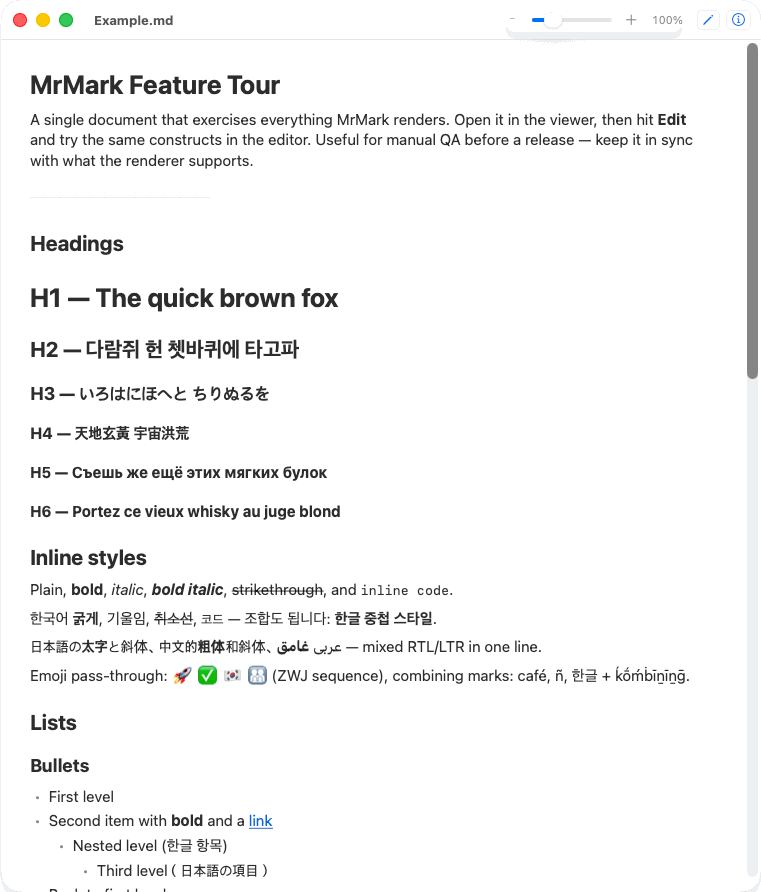

# MrMark

[](https://github.com/Jongsic/MrMark/actions/workflows/ci.yml)
[](https://github.com/Jongsic/MrMark/releases)
[](LICENSE)


An **ultra-fast, minimal Markdown viewer & editor**.
Native on each platform — Swift + AppKit on macOS, C++ + Win32 on Windows.
Not Electron, not a webview. One file = one window.
No workspace, no tabs, no plugins, no cloud, no telemetry.



Double-clicking a `.md` file shows a rendered, read-only view instantly.
Hit ✏️ to edit; hit 👁 to go back to reading. That's the whole app.

## Features

Both apps implement the same spec.

**Viewer (the fast path)**
- GitHub-flavored Markdown: headings, bold/italic/strikethrough, lists,
  blockquotes, fenced code blocks, inline code, links, images, tables
  (rendered as a borderless aligned grid)
- Task-list checkboxes are clickable — toggling writes `- [ ]` ↔ `- [x]`
  back to the document (undoable)
- Local images render inline; **remote images are never fetched**
- Find bar (⌘F / Ctrl+F), text zoom, dark mode

**Editor**
- Hybrid, Typora-style: the paragraph you're editing shows its Markdown
  source; everywhere else the syntax markers melt away. What you save is
  exactly the Markdown you wrote
- Formatting toolbar: bold, italic, H1–H3, bullet/numbered/task lists, link,
  image, code block — plus undo/redo and save
- Incremental restyling: only the edited block is re-highlighted

**Files, handled natively**
- Manual save (⌘S / Ctrl+S), dirty indicator, a Save / Don't Save prompt
  when closing unsaved changes; Open Recent; new documents open straight
  into the editor
- Edited outside MrMark (another editor, git, a script)? A clean document
  reloads automatically; unsaved edits are never touched and conflicts
  surface on save
- CRLF line endings and UTF-8 BOM survive open + save byte-exactly
- Offers **once** to become your default Markdown app — never silently

## Build

### macOS (`macos/`)

Requirements: macOS 14+, Xcode 16+, [XcodeGen](https://github.com/yonaskolb/XcodeGen).

```sh
brew install xcodegen
cd macos
xcodegen generate
xcodebuild -scheme MrMark -configuration Release build         # or: open MrMark.xcodeproj
xcodebuild -scheme MrMark -destination 'platform=macOS' test
```

The `.xcodeproj` is generated from `macos/project.yml` and is not checked in.

### Windows (`windows/`)

One native Win32 app (C++); the document view is the OS text control
(RichEdit), so selection, copy, IME, zoom, and screen-reader access all
behave exactly like Windows. The viewer and the hybrid editor are two modes
of the same window.

Requirements: Windows 10+ and the MSVC Build Tools
(`winget install Microsoft.VisualStudio.2022.BuildTools --override
"--quiet --wait --add Microsoft.VisualStudio.Workload.VCTools"`).

```powershell
cd windows
build.cmd            # -> bin\MrMark.exe
build.cmd test       # build + run the unit tests
bin\MrMark.exe file.md
```

Dependencies: AppKit + [swift-markdown](https://github.com/swiftlang/swift-markdown)
on macOS; Win32 + a hand-written GFM parser on Windows. That's the whole
list.

## Layout

Same shape on both platforms — the viewer is the fast path, editing
machinery loads lazily, pure logic is unit-tested:

```
macos/Sources/    App / Document / Viewer / Editor / UI     macos/Tests/
windows/src/      main (app shell) / parser / formatting / styler / document
windows/tests/    unit tests for the pure logic
design/           icon source and brand assets
```

## Performance

`MrMark --benchmark file.md` prints a stage breakdown on both platforms
(Windows also logs to `%TEMP%\MrMark-benchmark.log`).

| Release build | macOS (Apple Silicon) | Windows (x64) |
|---|---|---|
| Cold launch → readable document | ~250ms | ~130ms (warm ~70ms) |
| Memory per window | ~25MB | ~4MB |
| App binary | <1MB | ~0.3MB |

The Windows app's own work (read + parse + build the view) is ~30ms; the
rest is process start and the first window.

## Install

Both from [Releases](https://github.com/Jongsic/MrMark/releases). Builds are
not code-signed or notarized yet, so both OSes warn on first launch — the
one-time steps to get past that are below.

**macOS** — grab the `.dmg` and drag MrMark into Applications. On first
launch, macOS says it can't verify the app and only offers to move it to
the Trash. Don't — instead:

1. Dismiss the warning (**Done**).
2. Open **System Settings ▸ Privacy & Security** and scroll down to the
   *Security* section — you'll see *"MrMark" was blocked to protect your
   Mac* with an **Open Anyway** button.
3. Click **Open Anyway** and confirm. macOS remembers this; from then on
   MrMark opens normally.

(On macOS 14 and earlier, right-click the app ▸ **Open** is enough.)

**Windows** — if SmartScreen appears, choose **More info → Run anyway**.
Run `MrMark-Setup-<version>.exe`: installs per-user to
`%LOCALAPPDATA%\Programs\MrMark` (no admin), adds a Start Menu entry and the
`.md` "Open with" registration, and uninstalls from Settings ▸ Apps. To make
it the default: right-click a `.md` ▸ Open with ▸ MrMark ▸ Always.

Prefer no installer? `MrMark-<version>-windows-x64-portable.zip` is just
`MrMark.exe` — put it anywhere and run it; Help ▸ Set as Default wires up
the file association from wherever it lives.

## Non-goals

MrMark is deliberately small. There will be no plugins, tabs, sidebars, file
trees, split preview, cloud sync, accounts, AI, export suites, or telemetry.
If you need a knowledge system, this isn't it — it's the fast little app you
point `.md` files at.

## Contributing

See [CONTRIBUTING.md](CONTRIBUTING.md). Bug reports and small, focused PRs
are welcome; performance regressions and scope creep are the two things that
get a PR declined.

## License

[MIT](LICENSE)
